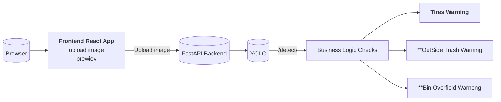

# Trash_detection_with_YOLO

Для обучения модели компьютерного зрения для детекции обектов я ипользовал фреймворк [Ultralitycs](https://docs.ultralytics.com/ru/).  

Данные собрал и разметил самостоятельно с помощью бесплатного инструмента [Label Studio](https://labelstud.io/guide). Готовый архив с данными уже лежит в корне этого проекта.

Для обучения модели достаточно сохранить к себе локально ноутбук, открыть его в Google Colab и запустить последовательно код. Ноутбук снабжен подробными комментариями на русском языке, он сам установит все необходимые зависимости и окружение, подключится к GitHub. Необходимо просто сохранять последовательность и следовать комментариям.

После того, как модель обучена и версия с наилучшими показателями сохранена - следующий этап. Я реализовал браузерное приложение для работы с моделью. Оно принимает изображение, отправляет его на сервер в модель, также на `backend` обрабатываются результаты работы модели. И далее структурированные данные возвращаются на `frontend`, где результаты и выводы визуализируются в браузере. Подробнее с реализацией [**backend**](https://github.com/nboravlev/Trash_detection_with_YOLO/tree/main/App/back) [**frontend**](https://github.com/nboravlev/Trash_detection_with_YOLO/tree/main/App/front) частей приложения можно ознакомиться в соответствующих разделах.

