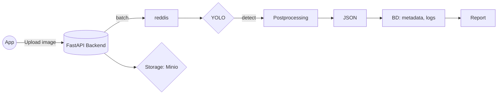

# Trash_detection_with_YOLO

Для обучения модели компьютерного зрения для детекции обектов я ипользовал фреймворк [Ultralitycs](https://docs.ultralytics.com/ru/).  

Данные собрал и разметил самостоятельно с помощью бесплатного инструмента [Label Studio](https://labelstud.io/guide). Готовый архив с данными уже лежит в корне этого проекта.

Для обучения модели достаточно сохранить к себе локально ноутбук, открыть его в Google Colab и запустить последовательно код. Ноутбук снабжен подробными комментариями на русском языке, он сам установит все необходимые зависимости и окружение, подключится к GitHub. Необходимо просто сохранять последовательность и следовать комментариям.

После того, как модель обучена и версия с наилучшими показателями сохранена - следующий этап. Я реализовал браузерное приложение для работы с моделью. Оно принимает изображение, отправляет его на сервер в модель, также на `backend` обрабатываются результаты работы модели. И далее структурированные данные возвращаются на `frontend`, где результаты и вывод визуализируются в браузере. 

Подробнее с реализацией [**backend**](https://github.com/nboravlev/Trash_detection_with_YOLO/tree/main/App/back) и [**frontend**](https://github.com/nboravlev/Trash_detection_with_YOLO/tree/main/App/front) частей приложения можно ознакомиться в соответствующих разделах.

Пример реальной работы в приложении:

```mermaid
flowchart LR

    A[📸 Камера или Фото площадки]
    A --> B["`⬆️ Загрузка изображения`"]
    B --> C["`📦 YOLOv8 Object Detection`"]
    C --> D["`🧠 Постобработка детекций`"]
    
    D --> D1{"`Объект: tires?`"}
    D --> D2{"`Объект: trash вне bin?`"}
    D --> D3{"`Bin заполнен > порога?`"}

    D1 -->|Да| E1["`⚠️ Визуальный warning: Покрышки запрещены`"]
    D2 -->|Да| E2["`⚠️ Мусор вне баков`"]
    D3 -->|Да| E3["`⚠️ Бак переполнен`"]

    D1 -->|Нет| X1["`✓ OK`"]
    D2 -->|Нет| X2["`✓ OK`"]
    D3 -->|Нет| X3["`✓ OK`"]

    E1 --> F["`📤 Формирование отчёта`"]
    E2 --> F
    E3 --> F
    X1 --> F
    X2 --> F
    X3 --> F

    F --> G["`📄 JSON / HTML отчёт + результат с BBox`"]
    G --> H["`👀 Отображение на интерфейсе или Dashboard`"]

```

